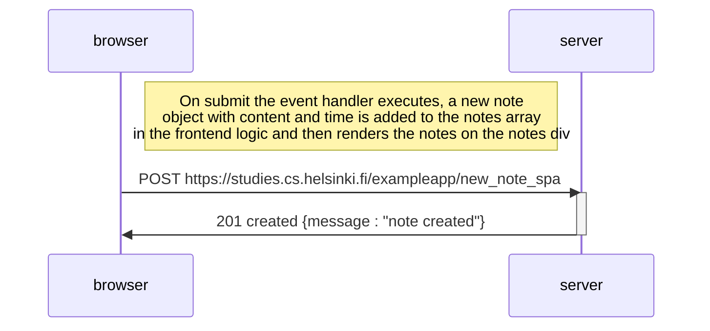

## New note 

```mermaid
sequenceDiagram
  participant browser
  participant server
  
  Note right of browser: On submit the event handler executes, a new note<br /> object with content and time is added to the notes array<br /> in the frontend logic and then renders the notes on the notes div

  browser ->> server: POST https://studies.cs.helsinki.fi/exampleapp/new_note_spa 
  
  activate server
  server ->> browser: 201 created {message : "note created"}
  deactivate server


```